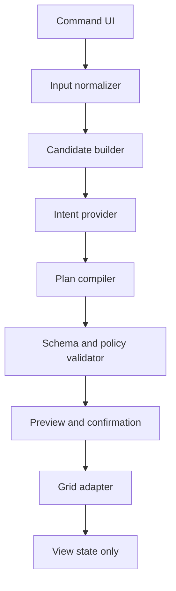
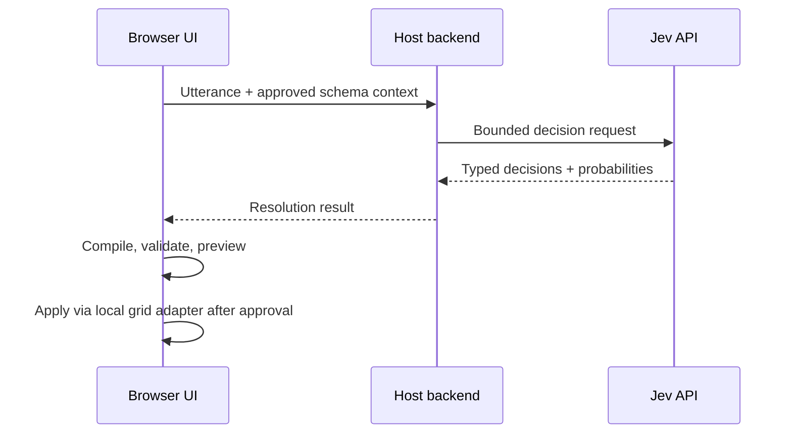

# Architecture

## Summary

GridCue is a compiler and control layer between a natural-language input and an existing grid's view-state API.



The semantic provider is deliberately boxed in. It may help choose from declared alternatives, but it cannot create a new capability, address an undeclared column, or directly invoke the adapter.

## Proposed workspace

| Area | Responsibility | Must not know about |
| --- | --- | --- |
| `packages/core` | Protocol, normalization, compilation, validation, diff, summary, audit redaction | React, DOM, TanStack, Jev transport |
| `packages/provider-jev` | Convert bounded resolution questions to Jev requests and normalize decisions | Grid internals, UI state mutation |
| `packages/react` | Command input, preview, clarification, apply/cancel/undo controls | Provider credentials, table-library internals |
| `packages/tanstack-table` | Translate canonical state/operations to TanStack Table | Natural-language classification |
| `apps/demo` | Reference assembly and synthetic examples | Production secrets or real client data |

## End-to-end pipeline

### 1. Snapshot context

The host provides:

- `ViewSchema`: allowed columns, types, aliases, descriptions, operators, sensitivity, and capabilities;
- `ViewCapabilities`: supported operations and adapter limitations;
- current canonical `ViewState` plus a revision token;
- policy settings and optional host-approved candidate values.

### 2. Normalize input deterministically

Normalize whitespace and common spoken punctuation without changing meaning. Extract literals that code handles better than a semantic model:

- numbers, currency, and percentages;
- comparators such as `over`, `at least`, and `between`;
- ISO and locale-aware dates when unambiguous;
- quoted text;
- explicit directions such as `largest first`;
- conjunctions that may indicate compound operations.

Preserve the original text for the immediate interaction. Logging it is a separate, opt-in host decision.

### 3. Build closed candidates

Candidate sets come from the schema and capability registry, never from provider invention. For example:

- possible action types: filter, sort, group, columns, reset, unsupported;
- columns eligible for each action;
- operators legal for the selected column type;
- values explicitly present in the utterance or supplied by an approved resolver;
- an explicit `none` or `ambiguous` choice.

### 4. Resolve semantics

An `IntentProvider` answers bounded questions. A Jev implementation should exploit parallel typed questions for operation presence and candidate selection. It must preserve probabilities/confidence and return an internal resolution object—not a public `ViewPlan` and not arbitrary JSON supplied by the model.

Jev is optimized for typed probabilistic decisions rather than text generation. That is an architectural advantage only if GridCue keeps the choice space closed and allows abstention.

### 5. Compile

Deterministic code combines parsed literals and semantic decisions into the canonical `ViewPlan`. It also detects:

- unresolved required slots;
- contradictory operations;
- repeated operations with unclear precedence;
- mixed allowed and prohibited actions;
- references to missing or disallowed fields.

### 6. Validate and diff

Validate the complete plan against runtime schemas, the current view revision, adapter capabilities, and host policy. Then compute a canonical before/after diff and render a templated summary.

No partial plan becomes applicable. A plan with one prohibited or unresolved material operation has status `needs_clarification` or `unsupported`.

### 7. Apply atomically

The adapter receives a validated plan tied to a base revision. It either commits every operation and returns the new state/revision, or changes nothing. The controller retains the prior state or inverse patch for Undo.

## Key interfaces

Names are illustrative; `docs/internals/intent-protocol.md` is normative for public shapes.

```ts
interface IntentProvider {
  resolve(request: ResolutionRequest): Promise<ResolutionResult>;
}

interface GridAdapter {
  getSchema(): ViewSchema;
  getCapabilities(): ViewCapabilities;
  getState(): Promise<VersionedViewState> | VersionedViewState;
  apply(plan: ApplicableViewPlan): Promise<ApplyResult>;
  restore(snapshot: VersionedViewState): Promise<ApplyResult>;
}
```

The core controller orchestrates these interfaces. Neither interface may call the other.

## Jev adapter strategy

Do not ask Jev to “turn this sentence into a JSON filter.” Instead:

1. Ask parallel yes/no or choice questions for which supported operation families are present.
2. For each present family, ask a choice over eligible columns plus `none`.
3. Restrict operators by selected column type and ask only when deterministic parsing cannot resolve one.
4. Bind values from deterministic parsing or a host-approved candidate list.
5. Carry confidence for every decision; derive plan confidence conservatively from material decisions.
6. Refuse to proceed when required decisions conflict or fall below policy thresholds.

Provider transport is injected and server-side. The package should expose a pure request builder and response parser so almost all behavior is testable without a network.

Because Jev is a new service and its API may evolve, keep endpoint names, model IDs, and vendor response details out of core. Verify them against current official TypeSafe documentation when implementing or upgrading the adapter.

## Data and trust boundaries

### Default provider payload may contain

- the user's current utterance;
- approved column IDs, display labels, aliases, short descriptions, and types;
- supported operation and operator candidates;
- current view configuration when needed;
- approved enum labels or semantic vocabulary.

### Default provider payload must not contain

- table rows or cell contents;
- account numbers, client names, tax lots, orders, or other record data;
- hidden-field values;
- credentials, tokens, cookies, or internal authorization details;
- unrestricted distinct values gathered from the dataset.

Hosts may extend the payload, but doing so is an explicit integration decision outside core defaults.

## Browser/server deployment

Recommended path:



The host backend owns the Jev credential and may further redact or map schema metadata. A fully server-side compile path is also valid when view state is available there. Direct browser-to-provider calls are not part of the reference design.

## State, concurrency, and undo

- Each plan carries `baseRevision`.
- Apply rejects a stale revision rather than overwriting intervening manual changes.
- The controller may offer to re-resolve against the new state.
- Adapter apply is atomic from the caller's perspective.
- Undo restores the exact prior canonical state when the adapter supports it; otherwise it applies a validated inverse patch.
- Undo also checks revision so it cannot erase unrelated later changes.

## Errors and observability

Use stable error codes grouped by stage:

- `INPUT_*`
- `RESOLUTION_*`
- `PLAN_*`
- `POLICY_*`
- `ADAPTER_*`
- `PROVIDER_*`

Safe observability fields include duration by stage, operation families, candidate counts, confidence bands, result status, error code, adapter/provider name, and protocol version. Raw utterances, column labels, values, provider payloads, and row data are excluded by default.

## Extensibility

New providers implement `IntentProvider`; new grids implement `GridAdapter`. Domain packs may contribute aliases, descriptions, and approved semantic definitions but cannot add executable behavior. New operation types require a protocol version decision, core validation, adapter capability negotiation, contract tests, and an ADR.
